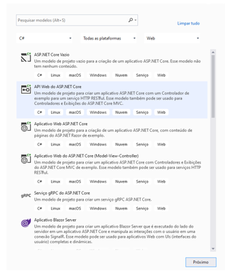
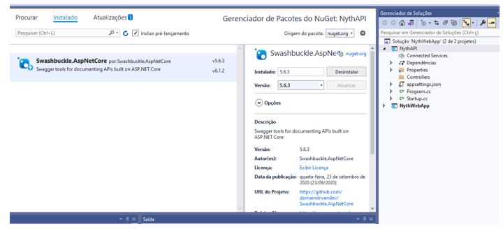
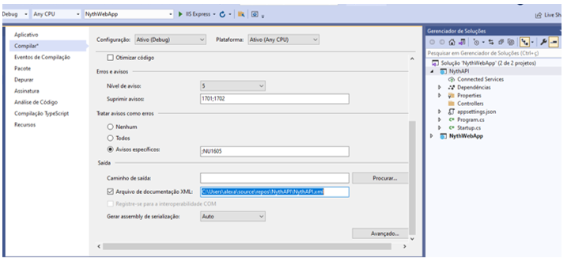
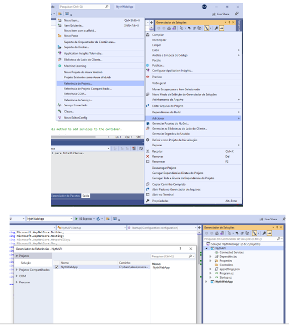
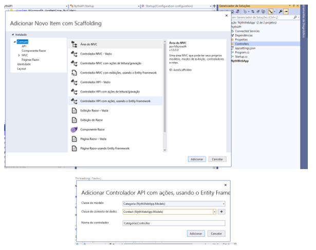
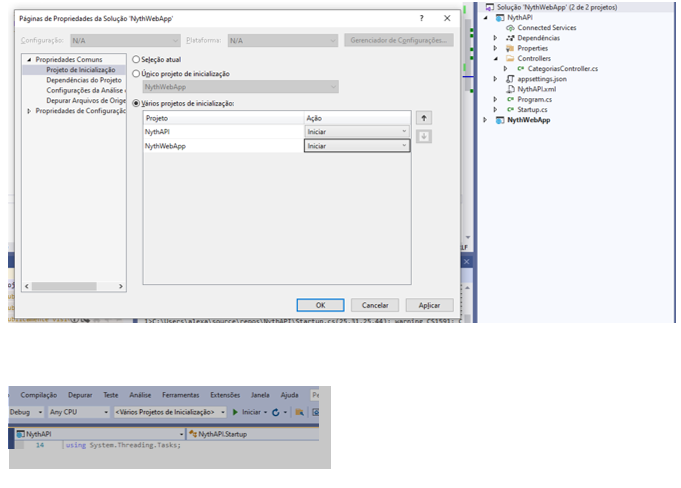
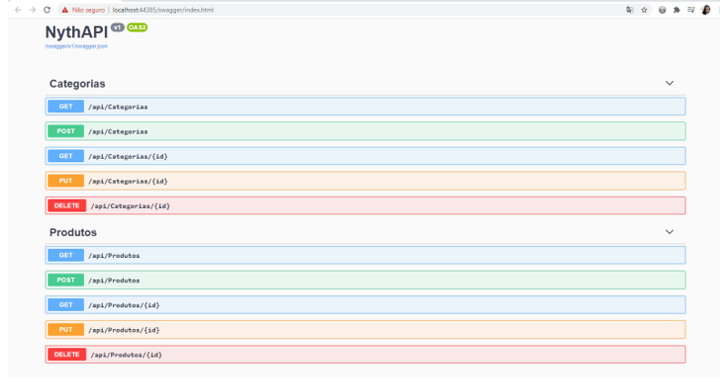

# NythAPI

<h2>CRIANDO UMA API DE CONTROLE</h2>
Nesse projeto foi criado uma API (Interface de programação de Aplicação) para realizar integração do aplicativo  <a href="https://github.com/Hozenyth/NythWebApp"> 
      NythWebApp
 </a>  
 Foi utilizado um Swagger, que é uma linguagem de descrição de interface para descrever APIs RESTful expressas usando JSON.

<h2>PASSO A PASSO</h2>

•	Adicionar novo projeto na Solution e selecionar API Web do ASP.NET Core

•	Com o botão direito clicar no projeto criado e ir em Gerenciar Pacotes NuGet e instalar o pacote:  
1. Swashbuckle.AspNetCore

•	Pra configurar o Swagger: com o botão direito clicar no projeto e ir em propriedades e fazer modificações como: ativar o arquivo XML.

•	Para aproveitar o Context e as Models. Clicar no projeto com o botão direito adicionar referência de projeto.

•	Na pasta do projeto API com o botão direito clicar Controller e adicionar novo item scaffold usando o Controlador API com ações usando Entity Framework e conectar ao Context do projeto MVC.
OBS.: Fazer o mesmo passo para a Classe Produtos.

<h2>RODANDO OS DOIS PROJETOS AO MESMO TEMPO</h2>

•	Clicar em Solution com o botão direito ir em propriedades e clicar em projetos de inicialização e selecionar a opção iniciar. Ao clicar em iniciar os dois projetos iniciarão ao mesmo tempo.

•	Na API o Swagger mostrará a categorias e todos os métodos da categoria. Cada método responderá a um código quando em caso de sucesso e qual objeto vai responder quando for sucesso.

•	Na API CategoriasController e ProdutosController:

<ol>
<li>GET api/Categorias ou Produtos: Chama os métodos da API, pega todas as categorias e manda listar.</li>
<li>GET {id} – pega o ID de uma categoria específica.</li>
<li>PUT – que efetua a atualização de uma determinada categoria ou produto.</li>
<li>POST – Inserir uma categoria ou produto.</li>
<li>DELETE – Deletar/Excluir uma categoria.</li>
<li>CategoriaExists – Validar se a categoria ou produto existe ou não.</li>
</ol>

