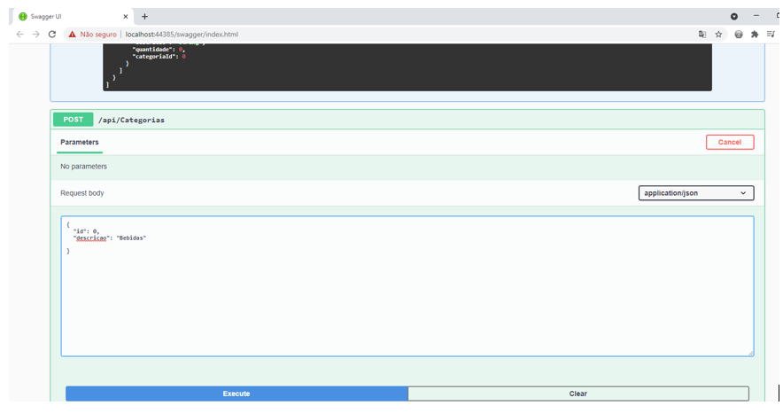
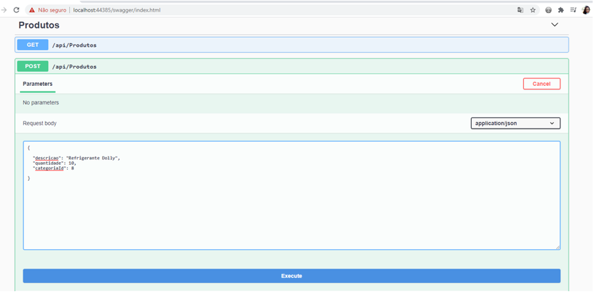
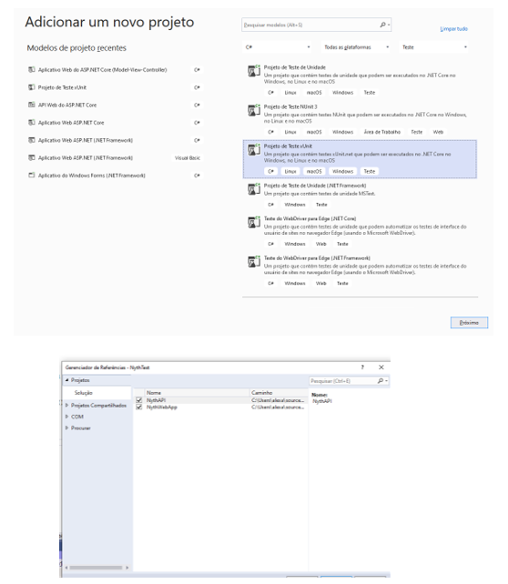

# NythAPI

<h2>CRIANDO UMA API DE CONTROLE E TESTE Xunit do MÉTODO GET</h2>
Nesse projeto foi criado uma API (Interface de programação de Aplicação) para realizar integração do aplicativo  <a href="https://github.com/Hozenyth/NythWebApp"> 
      NythWebApp
 </a>  
 Foi utilizado um Swagger, que é uma linguagem de descrição de interface para descrever APIs RESTful expressas usando JSON.

<h2>PASSO A PASSO</h2>

•	Adicionar novo projeto na Solution e selecionar API Web do ASP.NET Core

•	Com o botão direito clicar no projeto criado e ir em Gerenciar Pacotes NuGet e instalar o pacote:  
1. Swashbuckle.AspNetCore

•	Pra configurar o Swagger: com o botão direito clicar no projeto e ir em propriedades e fazer modificações como: ativar o arquivo XML.

•	Para aproveitar o Context e as Models. Clicar no projeto com o botão direito adicionar referência de projeto.

•	Na pasta do projeto API com o botão direito clicar Controller e adicionar novo item scaffold usando o Controlador API com ações usando Entity Framework e conectar ao Context do projeto MVC.
OBS.: Fazer o mesmo passo para a Classe Produtos.

<h2>RODANDO OS DOIS PROJETOS AO MESMO TEMPO</h2>

•	Clicar em Solution com o botão direito ir em propriedades e clicar em projetos de inicialização e selecionar a opção iniciar. Ao clicar em iniciar os dois projetos iniciarão ao mesmo tempo.

•	Na API o Swagger mostrará a categorias e todos os métodos da categoria. Cada método responderá a um código quando em caso de sucesso e qual objeto vai responder quando for sucesso.

•	Na API CategoriasController e ProdutosController:

<ol>
<li>GET api/Categorias ou Produtos: Chama os métodos da API, pega todas as categorias e manda listar.</li>
<li>GET {id} – pega o ID de uma categoria específica.</li>
<li>PUT – que efetua a atualização de uma determinada categoria ou produto.</li>
<li>POST – Inserir uma categoria ou produto.</li>
<li>DELETE – Deletar/Excluir uma categoria.</li>
<li>CategoriaExists – Validar se a categoria ou produto existe ou não.</li>
</ol>

•	No POST para adicionar uma categoria ou produto sem utilizar a home page NythWebApp basta atualizar o condigo JSON.  No POST o Id é autoincremente então não precisamos colocar uma Id específica. Exemplo de como adicionar uma Categoria e um Produto:

 
 

<h2>TESTANDO API COM xUNIT TEST COM MOQ</h2>

Os testes de projetos são essenciais para prever problemas futuros e agilizar o processo de manutenção dos códigos. Neste projeto Foi feito o teste da função GET.
Existem muitos frameworks que podemos usar para mocar objetos ou realizar o mocking em nossos projetos na plataforma .NET e neste artigo eu vou tratar do framework Moq que é uma biblioteca para mocar objetos para a plataforma .NET . Assim, ela suporta a mocagem de interfaces bem como classes. Sua API é extremamente simples e direta, e não requer nenhum conhecimento ou experiência prévia com os conceitos de mocking.
 
A sua instalação pode ser feita via Nuget ou manualmente como veremos no projeto exemplo.

•	Clicar na Solution com o botão direito e adicionar novo projeto de Test xUnit. No projeto de Test ir com o botão direito e referenciar os projetos que serão testados.  

•	Com o botão direito ir em Gerenciar pacote do Nugets e instalar o pacote:
<ol>
<li> install-Package Microsoft.EntityFrameworkCore </li>
<li> Install-Package Microsoft.EntityFrameworkCore.SqlServer </li>
<li> Install-Package Microsoft.EntityFrameworkCore.Tools </li>
E também o pacote do Moq.
</ol>
      

•	Adicionar nova classe ao projeto: CategoriasControllerTest.cs. No código item FACT que faz com que o Visual Studio reconheça que é um teste. Ir em adicionar e referenciar os dois projetos já existentes
O Moq ajuda a manter o foco em somente um teste. Na parte de GET por exemplo conseguimos impedir a duplicação de uma linha de código.
Neste teste foi feito apenas o método GET.

